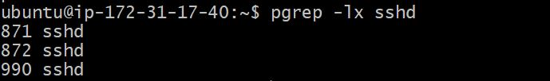
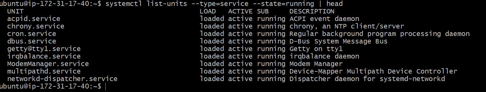
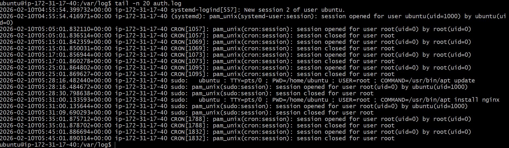

# check running processes

* `ps aux | head -n 10` - List running process for top 10 lines

* `pgrep -lx sshd` - Get the process ID with exact name ( -l shows the process ID, -x matches the exact process name)
  

# Inspecting one systemd service

* `systemctl status nginx` - Shows the status of nginx server
 

* `systemctl list-units --type=service --state=running | head` - Prints first 10 lines of running services status.
  

# Log Commands-
* `tail -n 20 /var/log/auth.log` - shows last 20 lines of auth.log
  
